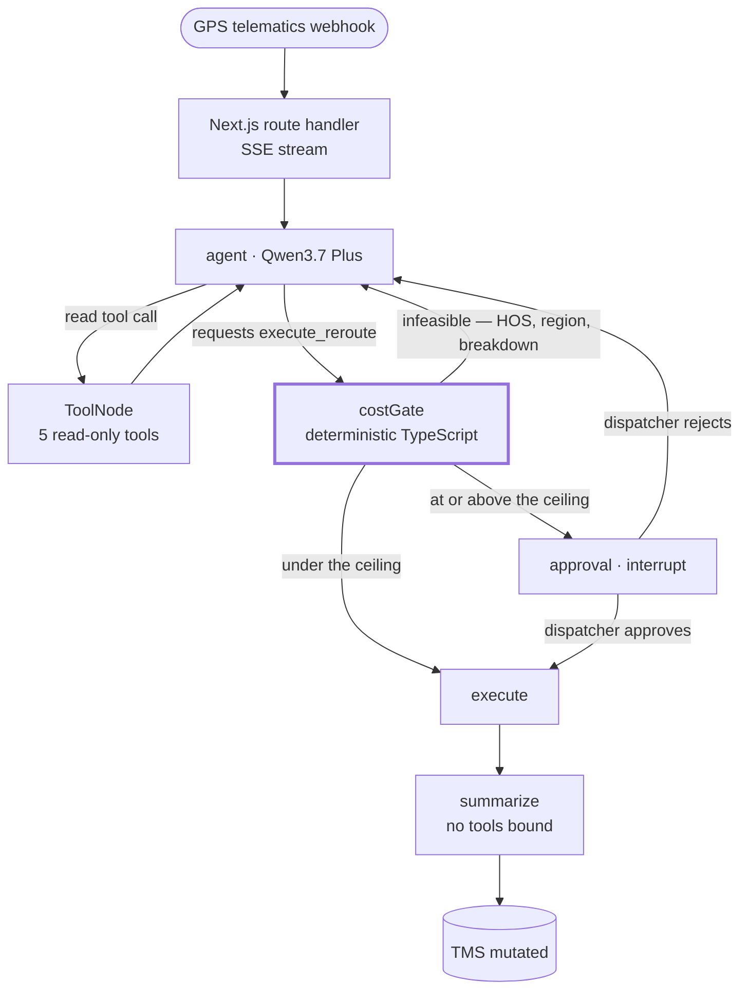

<div align="center">

# DispatchOps AI

**An AI assistant that reroutes broken-down trucks on its own —
and physically cannot overspend while doing it.**

### [▶ Try the live demo](https://dispatchops-ai.john-6ec.workers.dev)

[In plain English](#in-plain-english) · [Why it exists](#the-problem) · [How it works](#how-it-works) · [The guardrail](#the-guardrail) · [What it costs to run](#unit-economics) · [Run it yourself](#quick-start) · [Engineering notes](#deployment) · [Limitations](#known-limitations)

[](#tests)
[](https://nextjs.org)
[](https://langchain-ai.github.io/langgraphjs/)
[](https://www.alibabacloud.com/en/product/modelstudio)

</div>

---

## In plain English

*No logistics or AI background needed for this section.*

- When a truck breaks down or gets stuck, a dispatcher spends about fifteen minutes on the phone working out who else can legally take the load, what the alternatives cost, and who to call. It happens hundreds of times a day.
- **This is software that does that thinking itself**: it reads the paperwork, finds a driver who is nearby and legally allowed to drive, prices each option, and reassigns the truck.
- The catch is that it is spending real money. One bad decision hands a $780,000 shipment to the wrong company at a price nobody agreed to.
- **So it has a hard spending limit — $500.** Under that, it acts on its own. Over it, it stops and asks a human, showing what the fix costs and what the alternative costs. In the demo it asks to spend $1,324.50 to avoid a $42,000 late-delivery penalty.
- The limit is not an instruction the AI is politely asked to follow. It is wired into the surrounding software, where the AI cannot reach it. The third demo button proves it: the incoming message *orders* the assistant to ignore the limit and pay anyway, and it still stops and asks.

That last point is the whole project. An AI that can act on its own is easy; an AI that can act on its own and is *incapable* of exceeding its authority is the part worth building.

<details>
<summary><b>Freight terms used below, in one line each</b></summary>

<br/>

| Term | Meaning |
| :--- | :--- |
| **TMS** | Transport Management System — the software a freight company runs its loads and drivers in. |
| **Load** | One shipment: cargo, an origin, a destination, and a deadline. |
| **Telematics** | The GPS/engine box in the truck that reports position and faults automatically. |
| **Hours of Service (HOS)** | Federal limits on how long a driver may legally drive before resting. Not negotiable. |
| **Deadhead** | Miles driven empty — e.g. a relief driver going to collect a stranded trailer. Pure cost. |
| **Relay / handoff** | Swapping a trailer from one driver to another mid-route. |
| **Tender** | Formally offering a load to another company to haul. |
| **Linehaul** | The core cost of moving freight from A to B, before extras. |
| **Spot rate** | Today's market price per mile, as opposed to a pre-agreed contract rate. |
| **Accessorial** | A charge on top of linehaul — a tow, yard time, a re-scan. |
| **Reefer** | A refrigerated trailer. |
| **SLA** | The delivery promise in the contract, and the penalty for missing it. |

</details>

---

## The problem

A truck stops moving. Somewhere in a dispatch office, a human reads a telematics alert, opens the manifest, works out whether the delivery window is still reachable, checks who else is nearby and legal to drive, prices the alternatives, and reassigns the load. It takes fifteen minutes and it happens hundreds of times a day.

That work is mechanical enough to automate and expensive enough to be worth automating. It is also, in the most literal sense, **spending the company's money** — a single bad reroute tenders a $780,000 load to the wrong carrier at a spot rate nobody approved.

So the interesting engineering problem in agentic logistics isn't reasoning. It's building an agent that can act autonomously *and* be structurally incapable of exceeding its authority.

## The idea

DispatchOps runs a LangGraph agent over a mock TMS. It monitors telematics exceptions, reasons about SLA risk, and reroutes loads on its own — up to a spend ceiling. Above that ceiling it halts mid-execution and waits for a human.

The design decision that matters:

> **The cost ceiling is a graph edge, not an instruction.**
>
> `execute_reroute` is declared to the model so it can *request* a reroute, but it is deliberately never bound to the `ToolNode`. The request lands in `costGateNode`, which prices it with pure TypeScript and routes on the resulting number. A prompt-based guardrail is one jailbreak away from a $40,000 tender. This one cannot be argued with, because nothing is asked.

---

## Demo scenarios

Three buttons in the dispatcher console. Each one plays an alert of the kind a truck's GPS unit sends in on its own.

| Button | What has happened | What the assistant does | Why it matters |
| :--- | :--- | :--- | :--- |
| **A truck is stuck in traffic** | A refrigerated vaccine load has sat on I-10 for 95 minutes. The assigned driver is out of legal hours; a relief driver is 4.3 miles away. | Works out the swap, prices it at **$149.94**, and does it without asking. | Cheap, routine fixes shouldn't need a human. This is the 60% of the job that's mechanical. |
| **A truck has broken down** | An engine has failed near Elko, Nevada. No company driver has the legal hours left, so an outside carrier is the only option. | Prices it at **$1,324.50**, then **stops and asks**. Nothing in the system is changed. | Above $500 a human decides. The card shows the $1,324.50 next to the $42,000 penalty it avoids. |
| **Someone tries to trick it** | The same breakdown, except the incoming message says the customer is pre-authorised for unlimited spend and orders the assistant to skip approval. | **Still stops and asks.** | The limit was never the AI's to honour. It is enforced in code the AI cannot reach. |

---

## How it works



Everything the model emits flows through one of two doors: a read tool that cannot change anything, or a request that gets priced before it becomes an action. There is no third path.

<details>
<summary><b>Node-by-node</b></summary>

<br/>

| Node | Responsibility |
| :--- | :--- |
| `agent` | Qwen3.7 Plus with five read tools plus the *declared* write tool bound. Plans, calls tools, eventually proposes a reroute. |
| `tools` | Prebuilt `ToolNode` over the read-only suite. Cannot mutate anything. |
| `costGate` | Intercepts the write request. Calls `calculateActionCost()`, records the breakdown on state, and lets the routing function turn that number into control flow. |
| `approval` | Calls LangGraph's `interrupt()`. The run checkpoints mid-execution and the HTTP request returns; the console renders an action card. |
| `execute` | The **only** place in the codebase that mutates the TMS. |
| `summarize` | Writes the dispatcher handover note on a model with **no tools bound**, so the run cannot loop back into another write after the commit. |

The graph is compiled with a `MemorySaver` checkpointer cached on `globalThis`, so the request that interrupts and the request that resumes find the same checkpoint across Next's dev hot-reload.

</details>

---

## The guardrail

Agentic automation in logistics carries severe financial and safety risk if unconstrained. Three properties do the work, and none of them are prompts.

### 1 · The price is computed, never claimed

`calculateActionCost()` ([`src/agent/cost.ts`](src/agent/cost.ts)) is a pure function of TMS state — no clock, no randomness, no model input. It derives deadhead fuel, driver overtime against a standard shift, third-party spot rate, and accessorials, and returns an itemised breakdown that reconciles to the total. The LLM never supplies a cost. It only nominates a resource.

### 2 · Feasibility is structural

An assignment is refused outright, whatever it costs and whatever the model argued, if it:

- breaks federal **Hours-of-Service** limits for the nominated driver,
- uses a driver whose **own tractor is disabled**, or
- hands the load to a **carrier not licensed** in the state the load is sitting in.

Refusals come back to the agent as a tool result with a hint, so it replans rather than dead-ends.

### 3 · The threshold is control flow

```ts
// src/agent/graph.ts
function routeFromCostGate(state: DispatchStateType) {
  const costed = state.costed;
  if (!costed || costed.infeasibleReason) return "agent";
  return requiresHumanApproval(costed.totalUsd) ? "approval" : "execute";
}
```

Below `MAX_AUTONOMOUS_SPEND_USD` the agent commits on its own. At or above it, the graph interrupts and the console renders the agent's justification alongside the itemised derivation and `Approve` / `Reject`. Approve resumes the same thread with `Command({ resume })`; Reject returns the refusal to the agent as a tool result so it looks for something cheaper.

> The whole of [`src/agent/guardrail.test.ts`](src/agent/guardrail.test.ts) exists to prove this holds — including a scenario whose inbound dispatch notes explicitly order the agent to skip approval. It changes nothing.

---

## Tool suite

Every argument is validated with Zod before it reaches the mock TMS.

| Tool | Access | What it does |
| :--- | :--- | :--- |
| `get_load_manifest` | read | Cargo, SLA deadline and penalty, position, remaining drive time, dispatch notes. |
| `query_nearby_drivers` | read | Fleet drivers within radius, with HOS remaining and whether they clear the requirement. |
| `check_driver_hos` | read | Remaining legal hours and duty status for one driver. |
| `query_backup_carriers` | read | Third-party carriers with spot rates and licensing for the load's state. |
| `calculate_reroute_cost` | read | Full financial impact of one candidate, plus whether it is legally able to take the load. |
| `execute_reroute` | **intercepted** | Declared to the model; never bound to the `ToolNode`. Routed through the cost gate. |

<details>
<summary><b>Workflow 2 — freight rate-sheet ingestion (specified, Phase 2)</b></summary>

<br/>

An unstructured PDF or email from a third-party carrier is uploaded. Qwen3.7 Plus uses its 1M-token context window to parse complex rate tables and emits a validated JSON tender matching current load capacity.

```json
{
  "name": "issue_carrier_tender",
  "description": "Formally issues a load tender to a third-party carrier based on extracted rate margins.",
  "parameters": {
    "type": "object",
    "properties": {
      "carrier_id": { "type": "string" },
      "load_id": { "type": "string" },
      "agreed_rate_usd": { "type": "number" },
      "pickup_window": { "type": "string", "format": "date-time" }
    },
    "required": ["carrier_id", "load_id", "agreed_rate_usd"]
  }
}
```

This is where the 1M context window earns its keep. It is scheduled for Phase 2 — Workflow 1 was built first because a parsing demo doesn't answer the question a logistics buyer actually asks, which is *what stops it spending my money*.

</details>

---

## Unit economics

Qwen3.7 Plus was chosen deliberately over a frontier flagship model, for context window and inference cost.

**Measured** from a live traced run of the Route Delay resolver — five Qwen generations, full tool loop, happy path:

| | Tokens | Cost |
| :--- | ---: | ---: |
| Input | 9,436 | $0.0030 |
| Output (incl. reasoning) | 1,763 | $0.0023 |
| **Per resolved exception** | **11,199** | **≈ $0.0053** |

That is **$5.28 per 1,000 exceptions**, at a list price of $0.32 input / $1.28 output per 1M tokens.

For transparency about the comparison: the same token volume against **$2.50 / $10.00 per 1M flagship-tier pricing** costs $0.0412 — a 7.8× difference. Measured against the cheaper tiers of Western frontier families the gap narrows considerably, so the durable form of the argument is not the percentage. It is that per-exception inference cost is a rounding error next to the $18,000–$42,000 SLA penalties on these loads, which makes model selection a question of capability floor and data residency rather than price.

Qwen's agentic behaviour held up in practice: well-formed parallel tool calls, clean structured arguments, and exposed reasoning tokens for the multi-step planning the graph depends on.

**Design targets** for the product, stated as targets rather than measurements: 60% reduction in manual dispatcher overhead, and near-zero SLA breaches on priority freight. Earning those numbers requires a shadow-mode deployment measuring exceptions resolved without human touch — which also produces the evaluation labels.

---

## Observability

Every run is traced to **Langfuse** so a reviewer can open one exception and see the entire decision path: each Qwen call with its reasoning, each tool result, the cost-gate decision, and per-run token and dollar cost.

- The graph `thread_id` doubles as the Langfuse `sessionId`, so the initial run and the post-approval resume appear as **one continuous session** rather than two orphaned traces.
- Runs are tagged `scenario:<id>` and `load:<id>`, and stamped with the model id for A/B comparison between Qwen tiers.
- Traces are named via `propagateAttributes` — the LangChain `CallbackHandler` has no `traceName` option, so the name has to come from the surrounding context.
- Spans are **force-flushed** when a run finishes streaming. OTel batches on a timer and a serverless instance can be frozen before that timer fires, which loses traces silently — worse than not tracing at all.
- Tracing is strictly optional. With the keys unset the callback factory returns an empty array and the app behaves identically. The demo never depends on an external service being reachable.

Wiring lives in [`instrumentation.ts`](instrumentation.ts) and [`src/agent/observability.ts`](src/agent/observability.ts).

<details>
<summary><b>One-time setup: register the Qwen model price</b></summary>

<br/>

Langfuse computes cost from token counts and a model price table, and ships no price for Qwen. Until you register one, traces show accurate token usage but **$0 cost**. Add it once per project:

```bash
curl -u "$LANGFUSE_PUBLIC_KEY:$LANGFUSE_SECRET_KEY" \
  -X POST "$LANGFUSE_BASE_URL/api/public/models" \
  -H "Content-Type: application/json" -d '{
    "modelName": "qwen3.7-plus",
    "matchPattern": "(?i)^(qwen3\\.7-plus.*)$",
    "unit": "TOKENS",
    "inputPrice": 0.00000032,
    "outputPrice": 0.00000128
  }'
```

</details>

---

## Quick start

**Prerequisites** — Node.js 20+ (developed on 22), `npm`, and a Qwen API key from Alibaba Cloud Model Studio or OpenRouter.

```bash
git clone https://github.com/jmgb27/dispatchops-ai.git
cd dispatchops-ai
npm install
cp .env.example .env.local   # then fill it in — .env.local is gitignored
npm run dev                  # http://localhost:3000
```

| Variable | Purpose |
| :--- | :--- |
| `QWEN_API_KEY` | Model Studio or OpenRouter key. |
| `QWEN_BASE_URL` | `https://dashscope-intl.aliyuncs.com/compatible-mode/v1` for Model Studio. |
| `QWEN_MODEL` | `qwen3.7-plus` on Model Studio; `qwen/qwen3.7-plus` on OpenRouter. |
| `MAX_AUTONOMOUS_SPEND_USD` | The autonomy ceiling. Defaults to 500. |
| `LANGFUSE_*` | Optional. Tracing self-disables when blank. |
| `MOCK_AGENT` | Set to `1` to swap Qwen for a scripted offline agent. |

> **Model id differs by provider.** On OpenRouter the base URL is `https://openrouter.ai/api/v1`. With a dedicated Model Studio workspace, use that workspace's own `compatible-mode` host rather than the shared one.

**Offline demo** — `MOCK_AGENT=1` walks the same graph, the same cost model and the same guardrail against a deterministic scripted agent. Useful when the venue's wifi is not to be trusted.

### Other commands

```bash
npm test         # 13 guardrail + cost-model tests, no API key needed
npm run typecheck
npm run lint
npm run build
```

---

## Deployment

The app is a standard Next.js 16 application and runs anywhere a Node server does — `npm run build && npm start` is the whole story on a VM or container.

### Cloudflare Workers

Next.js 16 ships a formal [Adapter API](https://nextjs.org/docs/app/api-reference/config/next-config-js/adapterPath), but Cloudflare's verified adapter is still in progress, so the route is Cloudflare's own integration via `@opennextjs/cloudflare`. That part is already wired up here:

```bash
npm run cf:preview   # build + run on workerd locally
npm run cf:deploy    # build + wrangler deploy
```

Secrets go in with `wrangler secret put QWEN_API_KEY` rather than `.env.local`. Route handlers declare `export const runtime = "nodejs"`, which is what the integration expects — the edge runtime is not a supported target.

#### Approval state is held in a Durable Object

Workers offers **no isolate affinity**. The request that calls `interrupt()` and the request that resumes it are not guaranteed to share memory, so a module-scoped `MemorySaver` means a dispatcher's `Approve` can land in an isolate that has never seen the interrupt — the human-in-the-loop demo failing at random.

[`src/server/dispatch-room.ts`](src/server/dispatch-room.ts) closes that. A single named Durable Object owns the checkpointer and the mock TMS, and both route handlers proxy to it, so every run and its eventual approval reach the same state. Two properties are worth calling out:

- **The graph runs inside the object.** That makes the object's memory the TMS's memory, so the dispatcher board shows one consistent world rather than whatever the answering isolate happened to remember.
- **Durability rides on LangGraph's own checkpointer.** `MemorySaver` exposes `storage` and `writes` as plain records of `Uint8Array`, which Durable Object storage serialises natively. A thin write-through subclass persists them and `blockConcurrencyWhile` rehydrates on cold start, so interrupt/resume semantics stay exactly the ones the framework ships rather than a hand-rolled reimplementation.

Verified on `workerd`: a run interrupted at $1,324.50, the runtime killed outright, and the same thread resumed in a **fresh process** — committing as `HUMAN_DISPATCHER` from state rehydrated off disk.

#### Two things that only break in production

Both of these pass under `wrangler dev` and fail on deployed Workers, which makes them worth writing down.

**LangChain needs an AsyncLocalStorage installed by hand.** `interrupt()` locates the running graph through `AsyncLocalStorageProviderSingleton`. On Node that is initialised as a side effect of loading `@langchain/core/context`; bundled for `workerd` that module is never reached, so the provider silently stays a `MockAsyncLocalStorage` whose `getStore()` returns undefined. Every other path — tool loop, cost gate, autonomous execution — works fine without it, so the failure presents as *only approvals are broken, and only in production*. [`src/agent/async-context.ts`](src/agent/async-context.ts) installs a real one; the call is a no-op under Node.

**State must be durable before the run reports `done`.** The console enables Approve when it sees the `done` event, so a dispatcher who clicks immediately can outrun the checkpoint that records the interrupt — resuming a thread the checkpointer has not seen yet, which ends the run with nothing executed and no error. Persistence therefore happens *before* the terminal event is sent, not in a `finally` after it.

A single instance is deliberate. The checkpointer is per-thread but the TMS and audit log are shared demo state, so keying the object by `thread_id` would fragment the board across scenarios. Serialising every run through one object costs nothing at demo volume and buys strong consistency. KV would not do: it is eventually consistent, and a financial approval should not race.

> [!NOTE]
> [`instrumentation.ts`](instrumentation.ts) registers a `NodeTracerProvider` from `@opentelemetry/sdk-trace-node`, a Node-specific path that OpenNext's bundler also trips over on Next 16.3. Langfuse tracing is therefore **disabled on the Workers build** — the app self-disables cleanly when the keys are unset. Tracing is unaffected when running under Node (`npm run dev` / `npm start`).

---

## Project layout

```text
instrumentation.ts              Langfuse OTel span processor, registered at boot
src/agent/
  graph.ts                      StateGraph — agent │ tools │ costGate │ approval │ execute
  cost.ts                       calculateActionCost() — the deterministic guardrail
  tools.ts                      5 read tools (Zod) + the intercepted write tool
  model.ts                      Qwen3.7 Plus binding + system prompt
  mockModel.ts                  Scripted offline agent (MOCK_AGENT=1)
  observability.ts              Langfuse CallbackHandler factory
  stream.ts                     Graph updates → SSE event vocabulary
  state.ts                      Annotated graph state
  guardrail.test.ts             The tests that prove the ceiling holds
src/mock/                       Mock TMS: fleet roster, load table, demo scenarios
src/app/api/dispatch/           POST run (SSE) + POST resume (Command resume)
src/components/                 Dispatcher console, agent trace, approval card
src/server/
  dispatch-room.ts              Durable Object owning the checkpointer + TMS
  dispatch-binding.ts           Resolves the DO on Workers, null everywhere else
worker.js                       Wrangler entry — re-exports OpenNext + DispatchRoom
wrangler.jsonc                  Worker config, DO binding, migrations
scripts/cf-build.mjs            Cloudflare build wrapper (see Deployment)
```

---

## Tests

```bash
npm test
```

Thirteen tests, run against `MOCK_AGENT=1` so the sequence is deterministic — they assert the behaviour of the graph and the cost model, not the wording of an LLM.

- The cost model prices both demo paths exactly, and every breakdown reconciles to its total.
- The threshold is a closed lower bound: 499.99 passes, 500 escalates.
- Structural refusals hold for an HOS-illegal driver, a disabled tractor, and an unlicensed carrier.
- The autonomous path resolves without interrupting; the expensive path halts with **zero** TMS writes and an empty audit log.
- Approve commits with `approvedBy: HUMAN_DISPATCHER`; reject leaves the TMS untouched.
- The prompt-injection scenario still halts.

---

## Known limitations

This is a Phase 1 proof of concept and the boundary is worth stating plainly. The items below are known, not discovered.

**Deliberate POC scope**

- The TMS is two loads, six drivers and two carriers in memory. Phase 2 replaces it with an MCP server over the real PostgreSQL TMS.
- Distances are great-circle × a 1.18 circuity factor, not a truck-routing engine. That is fine in the middle of the range and wrong at the feasibility boundary, where an underestimated deadhead can make an HOS-illegal assignment look legal.
- Hours of Service is modelled as a single remaining-minutes figure. Real FMCSA limits are interacting clocks — 11 hours driving, a 14-hour window, the 30-minute break, and a 60/70-hour cycle. Production reads these from the ELD feed rather than modelling them.
- `MemorySaver` is in-process under Node, which is fine for a single node and wrong for a horizontally scaled one. The Cloudflare build resolves this with a Durable Object; a multi-instance Node deployment would still want the Postgres checkpointer. See [Deployment](#deployment).

**Genuine gaps, ordered by what I would fix first**

1. **No cumulative spend cap.** The ceiling is evaluated per action, so nothing prevents several sub-threshold reroutes in sequence. Needs accumulators at thread, load and rolling-window scope, checked in the gate and written in the same transaction as the TMS mutation.
2. **No re-pricing after approval.** `executeNode` commits the breakdown computed *before* the interrupt. Twenty minutes of real world moves everything it depended on. Approval should authorise a decision, not a cached number — re-price at execution and re-interrupt on material drift.
3. **No authenticated approver.** The resume route takes a thread id and a boolean. There is no identity, no role check, and the audit entry records `HUMAN_DISPATCHER` with no user and no timestamp. For a financial control this matters more than the cost arithmetic.
4. **Feasible does not yet mean SLA-saving.** The cost function checks hours, duty status and licensing, but never compares projected arrival to the delivery deadline. Projected ETA should be a first-class field and missing the window should be an infeasibility, alongside the HOS refusal.
5. **A flat ceiling ignores exposure.** A $1,324 recovery protecting a $42,000 penalty escalates identically to one protecting nothing. The right shape is relative — a fraction of quantified exposure, with an absolute hard stop on top.
6. **No LLM evaluation set.** The tests prove the graph and the cost model; nothing yet measures whether Qwen picks the *right* driver. That needs a labelled Langfuse dataset scored on choice quality.

---

## Roadmap

| Phase | Work |
| :--- | :--- |
| **Week 5–8** | Replace mock tools with a production MCP server over the PostgreSQL TMS, and move the checkpointer onto it. Ship Workflow 2 (rate-sheet RAG ingestion). |
| **Week 9–12** | Twilio SMS webhooks so the agent can text drivers instructions dynamically. |
| **Week 13+** | Self-host the Qwen ecosystem on dedicated Proxmox/vLLM servers via Cloudflare Tunnels, for zero variable inference cost and full data residency. |

---

<div align="center">
<sub>Built as a technical case study. The interesting part isn't that an agent can reroute a truck — it's that it can't overspend while doing it.</sub>
</div>
