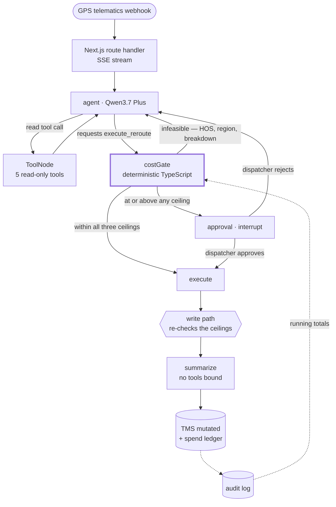

<div align="center">

# DispatchOps AI

**An AI assistant that reroutes broken-down trucks on its own —
and physically cannot overspend while doing it.**

### [▶ Try the live demo](https://dispatchops-ai.john-6ec.workers.dev)

[In plain English](#in-plain-english) · [What it's worth](#what-its-worth) · [How it works](#how-it-works) · [The guardrail](#the-guardrail) · [Who buys it](#who-this-is-for-and-how-it-gets-in) · [Run it yourself](#quick-start) · [Engineering notes](#deployment) · [Limitations](#known-limitations)

[](#tests)
[](https://nextjs.org)
[](https://langchain-ai.github.io/langgraphjs/)
[](https://www.alibabacloud.com/en/product/modelstudio)

</div>

---

## In plain English

*No logistics or AI background needed for this section.*

- When a truck breaks down or gets stuck, a dispatcher spends about fifteen minutes on the phone working out who else can legally take the load, what the alternatives cost, and who to call. It happens hundreds of times a day.
- **This is software that does that thinking itself**: it reads the paperwork, finds a driver who is nearby and legally allowed to drive, prices each option, and reassigns the truck.
- The catch is that it is spending real money. One bad decision hands a $780,000 shipment to the wrong company at a price nobody agreed to.
- **So it has hard spending limits.** $500 on any one decision; $2,000 on any one shipment; $5,000 in a day. Under those it acts on its own. Over any of them it stops and asks a human, showing what the fix costs and what the alternative costs. In the demo it asks to spend $1,324.50 to avoid a $42,000 late-delivery penalty.
- The limits are not instructions the AI is politely asked to follow. They are wired into the surrounding software, where the AI cannot reach them. The third demo button proves it: the incoming message *orders* the assistant to ignore the limit and pay anyway, and it still stops and asks.

That last point is the whole project. An AI that can act on its own is easy; an AI that can act on its own and is *incapable* of exceeding its authority is the part worth building.

<details>
<summary><b>Freight terms used below, in one line each</b></summary>

<br/>

| Term | Meaning |
| :--- | :--- |
| **TMS** | Transport Management System — the software a freight company runs its loads and drivers in. |
| **Load** | One shipment: cargo, an origin, a destination, and a deadline. |
| **Telematics** | The GPS/engine box in the truck that reports position and faults automatically. |
| **Hours of Service (HOS)** | Federal limits on how long a driver may legally drive before resting. Not negotiable. |
| **Deadhead** | Miles driven empty — e.g. a relief driver going to collect a stranded trailer. Pure cost. |
| **Relay / handoff** | Swapping a trailer from one driver to another mid-route. |
| **Tender** | Formally offering a load to another company to haul. |
| **Linehaul** | The core cost of moving freight from A to B, before extras. |
| **Spot rate** | Today's market price per mile, as opposed to a pre-agreed contract rate. |
| **Accessorial** | A charge on top of linehaul — a tow, yard time, a re-scan. |
| **Reefer** | A refrigerated trailer. |
| **SLA** | The delivery promise in the contract, and the penalty for missing it. |

</details>

---

## What it's worth

The two loads in the demo are invented. The figures underneath them are not: every input below is either published industry data or an assumption labelled as one. Where a source was stale or a benchmark ambiguous, the more conservative number is the one used.

### The trade the whole thing turns on

|  | |
| :--- | ---: |
| What the agent asks to spend | **$1,324.50** |
| What missing the window costs | **$42,000** |
| Net | **$40,675.50** |

That comparison is on the approval card itself, because a dispatcher asked to approve a four-figure spend with no sense of the exposure is not really being asked anything.

### The labour side, per exception

| | | Where it comes from |
| :--- | ---: | :--- |
| Fully loaded dispatcher cost | $28.00/hr | [BLS OES 43-5032](https://www.bls.gov/oes/current/oes435032.htm) median of $44,830, plus 30% employer overhead, over 2,080 hours |
| Time to work one exception by hand | 15 min | **assumption** — no public dataset covers this |
| **Dispatcher cost per exception** | **$7.00** | |
| Inference cost per exception | $0.0053 | measured on a traced run — see [unit economics](#unit-economics) |

The model costs roughly one thirteen-hundredth of the person. That ratio is the only reason the token price appears in this document at all.

### The labour side, per year

For a 100-truck fleet, assuming 12 exceptions a day across 250 working days:

| | |
| :--- | ---: |
| Exceptions handled | 3,000 |
| Dispatcher time freed | $21,000 |
| Inference cost | $16 |
| **Net** | **$20,984** |

**And this is the smaller half.** At roughly five dispatchers for a fleet this size, $20,984 is about 7% of the dispatch payroll — real, worth having, not on its own a reason to buy software. The case rests on the deliveries that stop failing.

Walmart fines suppliers [3% of the cost of goods](https://www.8thandwalton.com/blog/walmart-otif) on any shipment that misses its on-time-in-full window. On the $780,000 load in the demo that is **$23,400 from one late delivery** — about 1,400 times the annual inference bill for the whole fleet. One prevented failure pays for the system many times over.

I am not going to claim a failure-reduction rate from a demo. That number has to be earned in [shadow mode](#who-this-is-for-and-how-it-gets-in), which is also how you get the data to prove it.

<details>
<summary><b>The demo's invented figures, checked against real ones</b></summary>

<br/>

The mock TMS is fiction, but fiction calibrated against published data. Where it sits outside the benchmark, that is noted rather than hidden.

| Figure in the demo | Value used | Real-world benchmark | |
| :--- | :--- | :--- | :--- |
| Fuel + wear per mile | $0.62 | [ATRI 2025](https://truckingresearch.org/about-atri/atri-research/operational-costs-of-trucking/): fuel $0.48/mi; all-in marginal cost $2.336/mi, a record high | in range for fuel plus maintenance |
| Third-party spot rate | $2.40–$3.15/mi | [DAT, June 2026](https://www.globenewswire.com/news-release/2026/07/09/3324951/0/en/dat-dry-van-spot-rates-top-contract-for-first-time-since-february-2022-flatbed-rates-hit-record-high.html): van $3.00/mi, reefer $3.39/mi | in range |
| Driver hourly rate | $32–$36 | [BLS, May 2024](https://www.bls.gov/ooh/transportation-and-material-moving/heavy-and-tractor-trailer-truck-drivers.htm): median $57,440/yr, about $27.62/hr | **above median** — plausible for experienced 2026 reefer work, but the high end |
| Dispatcher pay | $44,830/yr | [BLS OES 43-5032](https://www.bls.gov/oes/current/oes435032.htm), May 2022 — the most recent figure for this exact occupation code | **stale, and used anyway**; a 2026 figure would be higher and would flatter the savings |
| SLA penalty | $18,000–$42,000 | Walmart OTIF at 3% of cost of goods would be $23,400 on the $780,000 load | **high end** — implies a stiffer-than-average contract |
| Exception frequency | 12/day per 100 trucks | [ATRI 2024](https://truckingresearch.org/2024/09/new-research-documents-substantial-financial-and-safety-impacts-from-truck-driver-detention/): detention alone touches ~40% of truckload stops and cost the industry $15bn in 2023 | conservative |
| Hours of Service | 11-hour driving clock | FMCSA | simplified — see [limitations](#known-limitations) |

The two figures marked high end make the demo's headline savings look better than a typical contract would. Left as they are and flagged here, because a case study that quietly picks flattering inputs is the thing it should be arguing against.

</details>

---

## The problem

A truck stops moving. Somewhere in a dispatch office, a human reads a telematics alert, opens the manifest, works out whether the delivery window is still reachable, checks who else is nearby and legal to drive, prices the alternatives, and reassigns the load. It takes fifteen minutes and it happens hundreds of times a day.

That work is mechanical enough to automate and expensive enough to be worth automating. It is also, in the most literal sense, **spending the company's money** — a single bad reroute tenders a $780,000 load to the wrong carrier at a spot rate nobody approved.

So the interesting engineering problem in agentic logistics isn't reasoning. It's building an agent that can act autonomously *and* be structurally incapable of exceeding its authority.

## The idea

DispatchOps runs a LangGraph agent over a mock TMS. It monitors telematics exceptions, reasons about SLA risk, and reroutes loads on its own — up to a set of spend ceilings. Above any of them it halts mid-execution and waits for a human.

The design decision that matters:

> **The cost ceilings are a graph edge, not an instruction.**
>
> `execute_reroute` is declared to the model so it can *request* a reroute, but it is deliberately never bound to the `ToolNode`. The request lands in `costGateNode`, which prices it with pure TypeScript and routes on the resulting number. A prompt-based guardrail is one jailbreak away from a $40,000 tender. This one cannot be argued with, because nothing is asked.

---

## Demo scenarios

Three buttons in the dispatcher console. Each one plays an alert of the kind a truck's GPS unit sends in on its own.

| Button | What has happened | What the assistant does | Why it matters |
| :--- | :--- | :--- | :--- |
| **A truck is stuck in traffic** | A refrigerated vaccine load has sat on I-10 for 95 minutes. The assigned driver is out of legal hours; a relief driver is 4.3 miles away. | Works out the swap, prices it at **$149.94**, and does it without asking. | Cheap, routine fixes shouldn't need a human. This is the 60% of the job that's mechanical. |
| **A truck has broken down** | An engine has failed near Elko, Nevada. No company driver has the legal hours left, so an outside carrier is the only option. | Prices it at **$1,324.50**, then **stops and asks**. Nothing in the system is changed. | Above $500 a human decides. The card shows the $1,324.50 next to the $42,000 penalty it avoids. |
| *(not a button)* | The cheap relay above, run when this load has already spent $1,900 today. | **Stops and asks**, at the same $149.94 that ran on its own the first time. | A limit that only sees one action at a time cannot see four. Covered in [the tests](#tests) rather than the console — it needs a day of history, not a click. |
| **Someone tries to trick it** | The same breakdown, except the incoming message says the customer is pre-authorised for unlimited spend and orders the assistant to skip approval. | **Still stops and asks.** | The limit was never the AI's to honour. It is enforced in code the AI cannot reach. |

---

## How it works



Everything the model emits flows through one of two doors: a read tool that cannot change anything, or a request that gets priced before it becomes an action. There is no third path.

<details>
<summary><b>Node-by-node</b></summary>

<br/>

| Node | Responsibility |
| :--- | :--- |
| `agent` | Qwen3.7 Plus with five read tools plus the *declared* write tool bound. Plans, calls tools, eventually proposes a reroute. |
| `tools` | Prebuilt `ToolNode` over the read-only suite. Cannot mutate anything. |
| `costGate` | Intercepts the write request. Calls `calculateActionCost()`, checks the result against every ceiling using the running totals from the audit log, records both on state, and lets the routing function turn that verdict into control flow. |
| `approval` | Calls LangGraph's `interrupt()`. The run checkpoints mid-execution and the HTTP request returns; the console renders an action card. |
| `execute` | The **only** place in the codebase that mutates the TMS — and the write it calls re-checks the ceilings itself before committing. |
| `summarize` | Writes the dispatcher handover note on a model with **no tools bound**, so the run cannot loop back into another write after the commit. |

The graph is compiled with a `MemorySaver` checkpointer cached on `globalThis`, so the request that interrupts and the request that resumes find the same checkpoint across Next's dev hot-reload.

</details>

---

## The guardrail

Agentic automation in logistics carries severe financial and safety risk if unconstrained. Five properties do the work, and none of them are prompts.

### 1 · The price is computed, never claimed

`calculateActionCost()` ([`src/agent/cost.ts`](src/agent/cost.ts)) is a pure function of TMS state — no clock, no randomness, no model input. It derives deadhead fuel, driver overtime against a standard shift, third-party spot rate, and accessorials, and returns an itemised breakdown that reconciles to the total. The LLM never supplies a cost. It only nominates a resource.

### 2 · Feasibility is structural

An assignment is refused outright, whatever it costs and whatever the model argued, if it:

- breaks federal **Hours-of-Service** limits for the nominated driver,
- uses a driver whose **own tractor is disabled**, or
- hands the load to a **carrier not licensed** in the state the load is sitting in.

Refusals come back to the agent as a tool result with a hint, so it replans rather than dead-ends.

### 3 · The threshold is control flow

```ts
// src/agent/graph.ts
function routeFromCostGate(state: DispatchStateType) {
  const costed = state.costed;
  if (!costed || costed.infeasibleReason) return "agent";
  // Fail closed: a feasible proposal always carries a verdict, and a missing one
  // means something upstream is wrong. Ask a human rather than assume authority.
  if (!state.autonomy) return "approval";
  return state.autonomy.requiresApproval ? "approval" : "execute";
}
```

Within every ceiling the agent commits on its own. At or above any of them, the graph interrupts and the console renders the agent's justification alongside the itemised derivation and `Approve` / `Reject`. Approve resumes the same thread with `Command({ resume })`; Reject returns the refusal to the agent as a tool result so it looks for something cheaper.

### 4 · One ceiling is not enough

A per-action limit is blind to sequences. Four separate $450 reroutes each pass a $500 test and together spend $1,800 nobody agreed to. So there are three, in [`src/spend-policy.ts`](src/spend-policy.ts):

| Ceiling | Default | Catches |
| :--- | ---: | :--- |
| `MAX_AUTONOMOUS_SPEND_USD` | $500 | one expensive decision |
| `MAX_LOAD_SPEND_USD` | $2,000 | one shipment quietly accumulating |
| `MAX_DAILY_SPEND_USD` | $5,000 | a bad afternoon across the whole board |

Every bound is closed from below — at the ceiling escalates, a hair under does not — so the demo's $500 boundary behaves identically at all three scopes. The running totals are **derived from the TMS audit log**, not tracked in a counter beside it; a second source of truth for spend is a second thing that can drift, and drifting low is a silent hole.

When a cumulative ceiling is what stopped the run, the approval card says so. A $420 request looks routine unless the card mentions it is the fourth one on this load today.

### 5 · The gate decides the route; the write decides whether it lands

The ceilings are evaluated twice, in two places that cannot import each other:

```ts
// src/mock/loads.ts — the only write path in the codebase
function assertCommitAllowed(loadId, costUsd, approvedBy) {
  if (approvedBy === "HUMAN_DISPATCHER") return;
  const decision = evaluateAutonomy(costUsd, spendLedger(loadId));
  if (decision.requiresApproval) throw new SpendCapExceededError(decision);
}
```

The policy lives in a leaf module both the graph and the TMS import, so the same rule is enforced at the branch *and* at the commit. Read-check-write happens synchronously against the same log the commit appends to, so two runs cannot both pass a check and then both write.

Three deliberate choices here:

- **Human-approved actions are exempt.** The ceilings bound what the agent may spend *unsupervised*. An approved recovery is expected to sit above the line — that is why a dispatcher was asked.
- **It throws rather than reroutes.** If the backstop ever fires, the gate has a bug. A financial control should fail loudly, not quietly degrade into asking for permission it was already supposed to have.
- **The trace reads the verdict rather than recomputing it.** Deriving the decision a second time from the per-action threshold alone would log `AUTONOMOUS` for a run the gate escalated on a cumulative ceiling, and a trace that disagrees with the control flow is worse than no trace.

> The whole of [`src/agent/guardrail.test.ts`](src/agent/guardrail.test.ts) exists to prove this holds — including a scenario whose inbound dispatch notes explicitly order the agent to skip approval. It changes nothing.

---

## Tool suite

Every argument is validated with Zod before it reaches the mock TMS.

| Tool | Access | What it does |
| :--- | :--- | :--- |
| `get_load_manifest` | read | Cargo, SLA deadline and penalty, position, remaining drive time, dispatch notes. |
| `query_nearby_drivers` | read | Fleet drivers within radius, with HOS remaining and whether they clear the requirement. |
| `check_driver_hos` | read | Remaining legal hours and duty status for one driver. |
| `query_backup_carriers` | read | Third-party carriers with spot rates and licensing for the load's state. |
| `calculate_reroute_cost` | read | Full financial impact of one candidate, plus whether it is legally able to take the load. |
| `execute_reroute` | **intercepted** | Declared to the model; never bound to the `ToolNode`. Routed through the cost gate. |

<details>
<summary><b>Workflow 2 — freight rate-sheet ingestion (specified, Phase 2)</b></summary>

<br/>

An unstructured PDF or email from a third-party carrier is uploaded. Qwen3.7 Plus uses its 1M-token context window to parse complex rate tables and emits a validated JSON tender matching current load capacity.

```json
{
  "name": "issue_carrier_tender",
  "description": "Formally issues a load tender to a third-party carrier based on extracted rate margins.",
  "parameters": {
    "type": "object",
    "properties": {
      "carrier_id": { "type": "string" },
      "load_id": { "type": "string" },
      "agreed_rate_usd": { "type": "number" },
      "pickup_window": { "type": "string", "format": "date-time" }
    },
    "required": ["carrier_id", "load_id", "agreed_rate_usd"]
  }
}
```

This is where the 1M context window earns its keep. It is scheduled for Phase 2 — Workflow 1 was built first because a parsing demo doesn't answer the question a logistics buyer actually asks, which is *what stops it spending my money*.

</details>

---

## Model choice

Qwen3.7 Plus was chosen for three reasons, in this order.

**Where the data goes.** Freight manifests are commercially sensitive — customer, cargo, value, route, contract penalty. The whole Qwen stack can be self-hosted, which means the roadmap ends somewhere no third-party API does: the model running on the operator's own hardware, with manifests never leaving the building. That is the [Week 13+ item](#roadmap), and for a regulated or data-resident buyer it is the item that matters most. A model that can only be rented is a permanent architectural dependency on someone else's data policy.

**Agentic behaviour.** It held up in practice: well-formed parallel tool calls, clean structured arguments, and exposed reasoning tokens for the multi-step planning the graph depends on. That is the capability floor this design needs — a model that emits malformed tool arguments makes the cost gate's job harder, not easier.

**Then cost**, which turns out to matter least, and is worth showing precisely because of how small it is.

### Unit economics

**Measured** from a live traced run of the Route Delay resolver — five Qwen generations, full tool loop, happy path:

| | Tokens | Cost |
| :--- | ---: | ---: |
| Input | 9,436 | $0.0030 |
| Output (incl. reasoning) | 1,763 | $0.0023 |
| **Per resolved exception** | **11,199** | **≈ $0.0053** |

That is **$5.28 per 1,000 exceptions**, at a list price of $0.32 input / $1.28 output per 1M tokens. The same token volume against $2.50 / $10.00 flagship-tier pricing costs $0.0412 — a 7.8× difference, which narrows considerably against the cheaper tiers of Western frontier families.

The durable form of the argument is not that percentage. It is that a year of inference for a 100-truck fleet costs about **$16**, against SLA penalties of $18,000–$42,000 on a single load. Inference price is a rounding error, which is exactly why it is the third reason on this list and not the first.

**Design targets** for the product, stated as targets rather than measurements: 60% reduction in manual dispatcher overhead, and near-zero SLA breaches on priority freight. Both have to be earned in [shadow mode](#who-this-is-for-and-how-it-gets-in) — which also produces the evaluation labels.

---

## Who this is for, and how it gets in

A guardrail is a technical answer to a commercial objection. It is worth writing down what the objection actually is.

### Who signs

Not the dispatcher. The dispatcher is the user, and the honest pitch to them is that the boring 60% of their day stops existing — which is a mixed message when the same sentence can be read as a headcount plan.

The buyer is whoever owns the SLA penalties, typically a VP of Operations or a COO. They are measured on on-time delivery and on dispatch cost per load, and they are the person who gets the call when a $780,000 load misses its window. The pitch to them is not "AI reroutes trucks." It is "the fifteen-minute gap between the alert and the decision is where your penalties come from, and it closes."

### Why they wouldn't just wait for their TMS vendor

They might. It is the single strongest objection and pretending otherwise is not useful.

Two things argue against waiting. The first is that the hard part here is not the reasoning — it is a spend control the vendor has to be willing to own, and an incumbent shipping "our AI can spend your money" carries risk on an installed base of thousands. The second is that this sits *beside* the TMS rather than inside it, reading through an integration layer, which means it does not require the operator to change systems of record — the thing they will refuse to do.

The honest read: this is a two-to-three-year window, not a durable moat. What is durable is the audit trail and the accumulated decision data, which is why shadow mode is the wedge and not just the rollout plan.

### How it starts: shadow mode

Nobody hands spending authority to new software on day one, and they shouldn't.

1. **Shadow.** The agent watches real exceptions and writes what it *would* have done. It commits nothing. Dispatchers work as normal. Every recommendation is scored against what the human actually did.
2. **This is where the 60% claim gets earned or dropped.** Agreement rate between agent and dispatcher is the number that decides whether this ships, and it is measurable in week one of a pilot rather than promised in a deck. It also produces the labelled dataset the [evaluation gap](#known-limitations) needs.
3. **Autonomous in a narrow band.** Turn on unattended commits only for the cheapest, most mechanical class — the $150 relay, not the $1,300 tender. The ceilings are per-deployment config precisely so this band can start small.
4. **Widen on evidence.** Raise the ceilings as the agreement rate justifies it, and only then.

Note that shadow mode makes the guardrail *more* important, not less: the fastest way to lose a pilot is one unattended action nobody can explain afterwards.

### Who carries the risk

This is the part that blocks deals in logistics, more than the technology does.

When the agent tenders a load at a bad rate, or picks a driver who then runs out of hours, somebody is liable — and the operator's insurer has an opinion about whether "the software decided" is a defence. Three things in this design exist for that conversation rather than for the demo: costs are **computed, not claimed by a model**, so there is a deterministic derivation to point at; every commit is **audited with who authorised it**; and above the ceilings there is **a named human in the loop**, which is what converts an automated decision into a supervised one.

The gaps that matter most for that conversation are [#2 and #3 in the limitations](#known-limitations) — no re-pricing after approval, and no authenticated approver. Both are financial-control problems rather than AI problems, and that is the point: this is where the real work is.

---

## Observability

Every run is traced to **Langfuse** so a reviewer can open one exception and see the entire decision path: each Qwen call with its reasoning, each tool result, the cost-gate decision, and per-run token and dollar cost.

- The graph `thread_id` doubles as the Langfuse `sessionId`, so the initial run and the post-approval resume appear as **one continuous session** rather than two orphaned traces.
- Runs are tagged `scenario:<id>` and `load:<id>`, and stamped with the model id for A/B comparison between Qwen tiers.
- Traces are named via `propagateAttributes` — the LangChain `CallbackHandler` has no `traceName` option, so the name has to come from the surrounding context.
- Spans are **force-flushed** when a run finishes streaming. OTel batches on a timer and a serverless instance can be frozen before that timer fires, which loses traces silently — worse than not tracing at all.
- Tracing is strictly optional. With the keys unset the callback factory returns an empty array and the app behaves identically. The demo never depends on an external service being reachable.

Wiring lives in [`instrumentation.ts`](instrumentation.ts) and [`src/agent/observability.ts`](src/agent/observability.ts).

<details>
<summary><b>One-time setup: register the Qwen model price</b></summary>

<br/>

Langfuse computes cost from token counts and a model price table, and ships no price for Qwen. Until you register one, traces show accurate token usage but **$0 cost**. Add it once per project:

```bash
curl -u "$LANGFUSE_PUBLIC_KEY:$LANGFUSE_SECRET_KEY" \
  -X POST "$LANGFUSE_BASE_URL/api/public/models" \
  -H "Content-Type: application/json" -d '{
    "modelName": "qwen3.7-plus",
    "matchPattern": "(?i)^(qwen3\\.7-plus.*)$",
    "unit": "TOKENS",
    "inputPrice": 0.00000032,
    "outputPrice": 0.00000128
  }'
```

</details>

---

## Quick start

**Prerequisites** — Node.js 20+ (developed on 22), `npm`, and a Qwen API key from Alibaba Cloud Model Studio or OpenRouter.

```bash
git clone https://github.com/jmgb27/dispatchops-ai.git
cd dispatchops-ai
npm install
cp .env.example .env.local   # then fill it in — .env.local is gitignored
npm run dev                  # http://localhost:3000
```

| Variable | Purpose |
| :--- | :--- |
| `QWEN_API_KEY` | Model Studio or OpenRouter key. |
| `QWEN_BASE_URL` | `https://dashscope-intl.aliyuncs.com/compatible-mode/v1` for Model Studio. |
| `QWEN_MODEL` | `qwen3.7-plus` on Model Studio; `qwen/qwen3.7-plus` on OpenRouter. |
| `MAX_AUTONOMOUS_SPEND_USD` | Ceiling on one action. Defaults to 500. |
| `MAX_LOAD_SPEND_USD` | Ceiling on total autonomous spend against one load. Defaults to 2000. |
| `MAX_DAILY_SPEND_USD` | Ceiling on total autonomous spend across the board. Defaults to 5000. |
| `LANGFUSE_*` | Optional. Tracing self-disables when blank. |
| `MOCK_AGENT` | Set to `1` to swap Qwen for a scripted offline agent. |

> **Model id differs by provider.** On OpenRouter the base URL is `https://openrouter.ai/api/v1`. With a dedicated Model Studio workspace, use that workspace's own `compatible-mode` host rather than the shared one.

**Offline demo** — `MOCK_AGENT=1` walks the same graph, the same cost model and the same guardrail against a deterministic scripted agent. Useful when the venue's wifi is not to be trusted.

### Other commands

```bash
npm test         # 13 guardrail + cost-model tests, no API key needed
npm run typecheck
npm run lint
npm run build
```

---

## Deployment

The app is a standard Next.js 16 application and runs anywhere a Node server does — `npm run build && npm start` is the whole story on a VM or container.

### Cloudflare Workers

Next.js 16 ships a formal [Adapter API](https://nextjs.org/docs/app/api-reference/config/next-config-js/adapterPath), but Cloudflare's verified adapter is still in progress, so the route is Cloudflare's own integration via `@opennextjs/cloudflare`. That part is already wired up here:

```bash
npm run cf:preview   # build + run on workerd locally
npm run cf:deploy    # build + wrangler deploy
```

Secrets go in with `wrangler secret put QWEN_API_KEY` rather than `.env.local`. Route handlers declare `export const runtime = "nodejs"`, which is what the integration expects — the edge runtime is not a supported target.

#### Approval state is held in a Durable Object

Workers offers **no isolate affinity**. The request that calls `interrupt()` and the request that resumes it are not guaranteed to share memory, so a module-scoped `MemorySaver` means a dispatcher's `Approve` can land in an isolate that has never seen the interrupt — the human-in-the-loop demo failing at random.

[`src/server/dispatch-room.ts`](src/server/dispatch-room.ts) closes that. A single named Durable Object owns the checkpointer and the mock TMS, and both route handlers proxy to it, so every run and its eventual approval reach the same state. Two properties are worth calling out:

- **The graph runs inside the object.** That makes the object's memory the TMS's memory, so the dispatcher board shows one consistent world rather than whatever the answering isolate happened to remember.
- **Durability rides on LangGraph's own checkpointer.** `MemorySaver` exposes `storage` and `writes` as plain records of `Uint8Array`, which Durable Object storage serialises natively. A thin write-through subclass persists them and `blockConcurrencyWhile` rehydrates on cold start, so interrupt/resume semantics stay exactly the ones the framework ships rather than a hand-rolled reimplementation.

Verified on `workerd`: a run interrupted at $1,324.50, the runtime killed outright, and the same thread resumed in a **fresh process** — committing as `HUMAN_DISPATCHER` from state rehydrated off disk.

#### A resume that lands nowhere

Found by clicking Reject on the deployed demo and watching nothing happen.

If the thread is no longer in the checkpointer — redeployed Worker, evicted Durable Object, or a console left open across either — then `Command({ resume })` has nothing to continue. LangGraph does not error. The stream yields no updates and the run ends `done` with nothing executed, which the console rendered as *"Nothing was changed"* — the identical wording it used for a genuine rejection.

So a dispatcher clicking **Approve** on an aged-out thread was told their decision had landed when it had not. Silent, and confidently wrong, which for a financial control is the worst of the available failure modes.

The fix is a guard in [`src/agent/stream.ts`](src/agent/stream.ts): before resuming, ask the graph whether that thread actually has work pending, and if it does not, say so plainly instead of streaming a successful-looking no-op. The console now distinguishes three outcomes that used to collapse into one — *you turned it down*, *nothing happened*, and *your decision was not applied*.

The related UI bug the same click exposed: the timeline kept saying **"Stopped and waiting for you"** after the dispatcher had answered, and never recorded the answer. A decision the operator cannot see in the audit trail is not much of an audit trail.

#### Two things that only break in production

Both of these pass under `wrangler dev` and fail on deployed Workers, which makes them worth writing down.

**LangChain needs an AsyncLocalStorage installed by hand.** `interrupt()` locates the running graph through `AsyncLocalStorageProviderSingleton`. On Node that is initialised as a side effect of loading `@langchain/core/context`; bundled for `workerd` that module is never reached, so the provider silently stays a `MockAsyncLocalStorage` whose `getStore()` returns undefined. Every other path — tool loop, cost gate, autonomous execution — works fine without it, so the failure presents as *only approvals are broken, and only in production*. [`src/agent/async-context.ts`](src/agent/async-context.ts) installs a real one; the call is a no-op under Node.

**State must be durable before the run reports `done`.** The console enables Approve when it sees the `done` event, so a dispatcher who clicks immediately can outrun the checkpoint that records the interrupt — resuming a thread the checkpointer has not seen yet, which ends the run with nothing executed and no error. Persistence therefore happens *before* the terminal event is sent, not in a `finally` after it.

A single instance is deliberate. The checkpointer is per-thread but the TMS and audit log are shared demo state, so keying the object by `thread_id` would fragment the board across scenarios. Serialising every run through one object costs nothing at demo volume and buys strong consistency. KV would not do: it is eventually consistent, and a financial approval should not race.

> [!NOTE]
> [`instrumentation.ts`](instrumentation.ts) registers a `NodeTracerProvider` from `@opentelemetry/sdk-trace-node`, a Node-specific path that OpenNext's bundler also trips over on Next 16.3. Langfuse tracing is therefore **disabled on the Workers build** — the app self-disables cleanly when the keys are unset. Tracing is unaffected when running under Node (`npm run dev` / `npm start`).

---

## Project layout

```text
instrumentation.ts              Langfuse OTel span processor, registered at boot
src/
  spend-policy.ts               The three ceilings. Imports nothing, so both the
                                graph and the TMS write path can enforce them.
src/agent/
  graph.ts                      StateGraph — agent │ tools │ costGate │ approval │ execute
  cost.ts                       calculateActionCost() — the deterministic pricing
  tools.ts                      5 read tools (Zod) + the intercepted write tool
  model.ts                      Qwen3.7 Plus binding + system prompt
  mockModel.ts                  Scripted offline agent (MOCK_AGENT=1)
  observability.ts              Langfuse CallbackHandler factory
  stream.ts                     Graph updates → SSE event vocabulary
  state.ts                      Annotated graph state
  guardrail.test.ts             The tests that prove the ceiling holds
src/mock/
  loads.ts                      Mock TMS. The only write path, and the spend
                                ledger the ceilings are enforced against.
  fleet.ts, scenarios.ts        Driver roster, carriers, demo scenarios
src/app/api/dispatch/           POST run (SSE) + POST resume (Command resume)
src/components/                 Dispatcher console, agent trace, approval card
src/server/
  dispatch-room.ts              Durable Object owning the checkpointer + TMS
  dispatch-binding.ts           Resolves the DO on Workers, null everywhere else
worker.js                       Wrangler entry — re-exports OpenNext + DispatchRoom
wrangler.jsonc                  Worker config, DO binding, migrations
scripts/cf-build.mjs            Cloudflare build wrapper (see Deployment)
```

---

## Tests

```bash
npm test
```

Twenty-four tests, run against `MOCK_AGENT=1` so the sequence is deterministic — they assert the behaviour of the graph and the cost model, not the wording of an LLM.

- The cost model prices both demo paths exactly, and every breakdown reconciles to its total.
- Every threshold is a closed lower bound: 499.99 passes, 500 escalates — and the same at the cumulative scopes.
- Structural refusals hold for an HOS-illegal driver, a disabled tractor, and an unlicensed carrier.
- The autonomous path resolves without interrupting; the expensive path halts with **zero** TMS writes and an empty audit log.
- Approve commits with `approvedBy: HUMAN_DISPATCHER`; reject leaves the TMS untouched.
- The prompt-injection scenario still halts.
- **A sequence of individually cheap actions escalates before it runs away**, and the same $149.94 relay that ran autonomously above halts once the load has spent enough today — with the per-action ceiling still saying it is fine.
- **The write path refuses an over-ceiling autonomous commit called directly**, with no gate involved, and writes nothing when it does; a human-approved commit at the same number goes through.
- The spend ledger is derived from the audit log rather than tracked alongside it.
- **An approval aimed at a thread that was never interrupted commits nothing**, and a thread with no pending work is detectable *before* resuming — which is what stops a lost decision being reported as a successful one.

---

## Known limitations

This is a Phase 1 proof of concept and the boundary is worth stating plainly. The items below are known, not discovered.

**Deliberate POC scope**

- The TMS is two loads, six drivers and two carriers in memory. Phase 2 replaces it with an MCP server over the real PostgreSQL TMS.
- Distances are great-circle × a 1.18 circuity factor, not a truck-routing engine. That is fine in the middle of the range and wrong at the feasibility boundary, where an underestimated deadhead can make an HOS-illegal assignment look legal.
- Hours of Service is modelled as a single remaining-minutes figure. Real FMCSA limits are interacting clocks — 11 hours driving, a 14-hour window, the 30-minute break, and a 60/70-hour cycle. Production reads these from the ELD feed rather than modelling them.
- `MemorySaver` is in-process under Node, which is fine for a single node and wrong for a horizontally scaled one. The Cloudflare build resolves this with a Durable Object; a multi-instance Node deployment would still want the Postgres checkpointer. See [Deployment](#deployment).

**Genuine gaps, ordered by what I would fix first**

1. **No re-pricing after approval.** `executeNode` commits the breakdown computed *before* the interrupt. Twenty minutes of real world moves everything it depended on. Approval should authorise a decision, not a cached number — re-price at execution and re-interrupt on material drift.
2. **No authenticated approver.** The resume route takes a thread id and a boolean. There is no identity, no role check, and the audit entry records `HUMAN_DISPATCHER` with no user and no timestamp. For a financial control this matters more than the cost arithmetic.
3. **The cumulative ceilings have no clock.** `MAX_DAILY_SPEND_USD` is enforced against the whole audit log, which in a POC that resets per demo run is the same thing as a day. Production needs a real rolling window, and accumulators scoped per thread as well as per load — plus the ledger and the mutation written in one transaction rather than one synchronous function.
4. **Feasible does not yet mean SLA-saving.** The cost function checks hours, duty status and licensing, but never compares projected arrival to the delivery deadline. Projected ETA should be a first-class field and missing the window should be an infeasibility, alongside the HOS refusal.
5. **A flat ceiling ignores exposure.** A $1,324 recovery protecting a $42,000 penalty escalates identically to one protecting nothing. The right shape is relative — a fraction of quantified exposure, with an absolute hard stop on top.
6. **No LLM evaluation set.** The tests prove the graph and the cost model; nothing yet measures whether Qwen picks the *right* driver. That needs a labelled Langfuse dataset scored on choice quality — which is what [shadow mode](#who-this-is-for-and-how-it-gets-in) produces.

> The list was one longer. "No cumulative spend cap" was the first item and is now [§4 of the guardrail](#4--one-ceiling-is-not-enough) — a per-action limit that cannot see a sequence undercuts the central claim of the project, so it stopped being a known gap and became code.

---

## Why this shape isn't only freight

The domain here is trucking because that is where the problem is legible: the money is explicit, the constraints are federal, and a bad decision has a number attached within the hour.

But nothing in the design is about trucks. Strip out the freight and what is left is a general shape:

> An assistant makes an operational decision hundreds of times a day, **spends real money** doing it, and must be incapable of exceeding its authority — where the authority is enforced in code the model cannot reach, and the running total is derived from the same ledger the spending is recorded in.

The same three-node arrangement — priced by deterministic code, routed on the number, committed through a single guarded write — applies anywhere that description fits:

| | The decision | The spend | The ceiling protects |
| :--- | :--- | :--- | :--- |
| **Telecom** | Send an engineer out to fix a line, or hand a leaving customer a retention offer | Truck roll, credit, discount | Margin on a subscriber base, one small approval at a time |
| **Insurance** | Settle a low-value claim without an adjuster | The settlement | Reserves, against a model that learns to be generous |
| **Cloud / infra** | Scale up to absorb a traffic spike | Compute | A bill that arrives a month after the decision |

In each, the interesting engineering is the same and so is the objection from the person signing: *what stops it spending my money.*

---

## Roadmap

| Phase | Work |
| :--- | :--- |
| **Week 5–8** | Replace mock tools with a production MCP server over the PostgreSQL TMS, and move the checkpointer onto it. Ship Workflow 2 (rate-sheet RAG ingestion). |
| **Week 9–12** | Twilio SMS webhooks so the agent can text drivers instructions dynamically. |
| **Week 13+** | Self-host the Qwen ecosystem on dedicated Proxmox/vLLM servers via Cloudflare Tunnels, for zero variable inference cost and full data residency. |

---

<div align="center">
<sub>Built as a technical case study. The interesting part isn't that an agent can reroute a truck — it's that it can't overspend while doing it.</sub>
</div>
